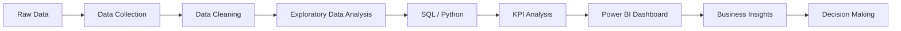

<div align="center">

# 👋 Hi, I'm **Lokeshvaran M K**

### 📊 Data Analyst • SQL • Python • Power BI • Excel


<br>

**Turning raw data into meaningful insights and business decisions.**

<br>

[](https://github.com/LokeshMK01)
[](https://www.linkedin.com/in/lokeshvaran-mk/)

</div>

---

## 🧑‍💻 About Me

I'm an **Entry-Level Data Analyst** with practical experience in **SQL, Python, Power BI, Excel, data cleaning, exploratory data analysis, and data visualization**.

I enjoy transforming raw and unstructured datasets into **clear dashboards, actionable insights, and data-driven recommendations**.

### 🎯 My Focus

```text
Raw Data
    ↓
Data Cleaning
    ↓
Exploratory Analysis
    ↓
SQL / Python Analysis
    ↓
KPI & Business Analysis
    ↓
Power BI Visualization
    ↓
Actionable Insights
```

---

## 🛠️ Technical Stack

### 📊 Data Analytics

<p>


</p>

### 📈 Business Intelligence

<p>


</p>

### 🧠 Core Skills

`Data Cleaning` • `EDA` • `KPI Analysis` • `Data Visualization` • `Data Modeling` • `Statistical Analysis` • `Business Intelligence`

---

# 🚀 Featured Projects

<table>
<tr>
<td width="50%">

### 📈 Sales Analysis Dashboard

**Power BI • SQL • Excel**

Interactive dashboard analyzing:

- Revenue performance
- Transaction trends
- Year-wise sales
- KPIs
- Business performance

<a href="https://github.com/LokeshMK01/Sales_Dashboard">

</a>

</td>

<td width="50%">

### 🛒 E-Commerce Data Analysis

**SQL • BigQuery**

Analyzed:

- Customer behavior
- Product performance
- Orders
- Sales trends
- Business insights

<a href="https://github.com/LokeshMK01/ecommerce-bigquery-analysis">

</a>

</td>
</tr>

<tr>
<td width="50%">

### 👥 HR Analytics Dashboard

**Power BI • SQL • Excel**

Analyzed:

- Employee data
- Workforce metrics
- HR KPIs
- Department performance
- Workforce insights

<a href="https://github.com/LokeshMK01/HR-Analytics-Dashboard-powerBi">

</a>

</td>

<td width="50%">

### 🏥 Healthcare Record Dashboard

**Power BI • Excel**

Explored:

- Patient records
- Healthcare metrics
- Patient trends
- Data visualization
- Healthcare insights

<a href="https://github.com/LokeshMK01/Healthcare-Record-Dashboard">

</a>

</td>
</tr>

<tr>
<td colspan="2">

### 💰 Financial Dashboard

**Power BI • Excel**

Interactive financial analysis covering revenue, profit, expenses, cash flow and financial KPIs.

<div align="center">

<a href="https://github.com/LokeshMK01/Financial_Dashboard">

</a>

</div>

</td>
</tr>
</table>

---

# 📊 Data Analyst Workflow



---

# 📌 What I Can Do

| Area | Skills |
|---|---|
| 🔍 Data Analysis | SQL, Python, Excel |
| 🧹 Data Cleaning | Pandas, Excel, Power Query |
| 📊 Visualization | Power BI, Tableau, Excel |
| 📈 Business Analysis | KPI, Trends, Performance |
| 🗄️ Databases | MySQL, Oracle, BigQuery |
| 📐 Analytics | EDA, Statistics |
| 📋 Reporting | Dashboards, Reports, Insights |

---

# 📚 Currently Learning

```text
Advanced SQL
     │
     ├── Window Functions
     ├── CTEs
     ├── Query Optimization
     └── Advanced Analytics

Power BI
     │
     ├── Advanced DAX
     ├── Data Modeling
     ├── Power Query
     └── Dashboard Design

Python
     │
     ├── Pandas
     ├── NumPy
     ├── Matplotlib
     └── Data Analysis

AI
     │
     ├── Machine Learning
     ├── Generative AI
     └── AI Tools for Data Analytics
```

---

# 🏆 Certifications

🎓 **Data Science & AI**  
🐍 **Python Programming**  
🤖 **Data Science & AI – NASSCOM**

---

# 📈 GitHub Activity

<div align="center">


<br>


</div>

---

# 🎯 Career Objective

> **Looking for Entry-Level Data Analyst / Junior Data Analyst opportunities where I can use SQL, Python, Power BI and Excel to solve real-world business problems and deliver actionable insights.**

---

# 🤝 Let's Connect

<div align="center">

<a href="https://github.com/LokeshMK01">

</a>

<a href="https://github.com/LokeshMK01">

</a>

<br><br>

**📊 Analyze • 📈 Visualize • 💡 Understand • 🚀 Decide**

</div>

---

<div align="center">

### ⭐ Thanks for visiting my profile!

</div>

